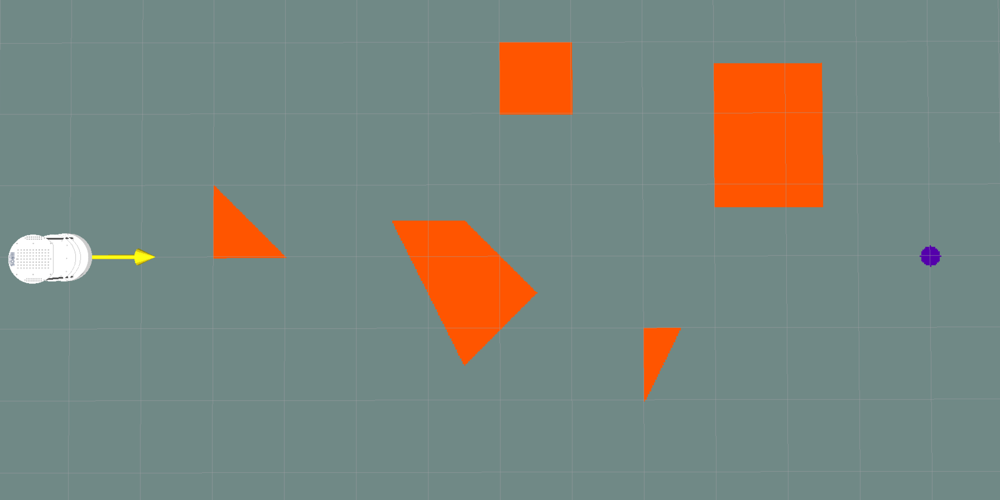
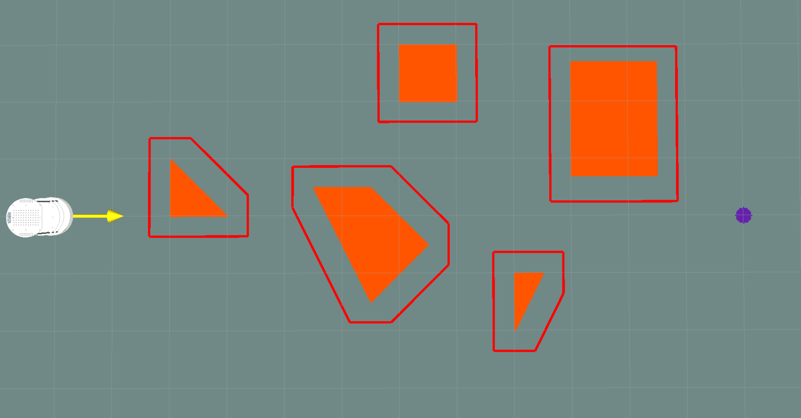
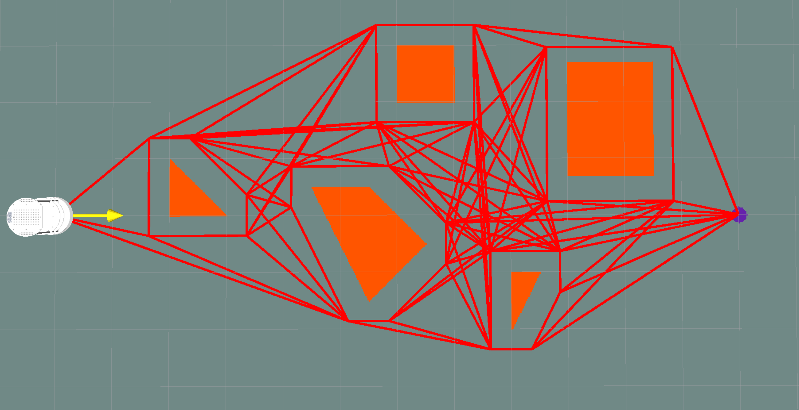
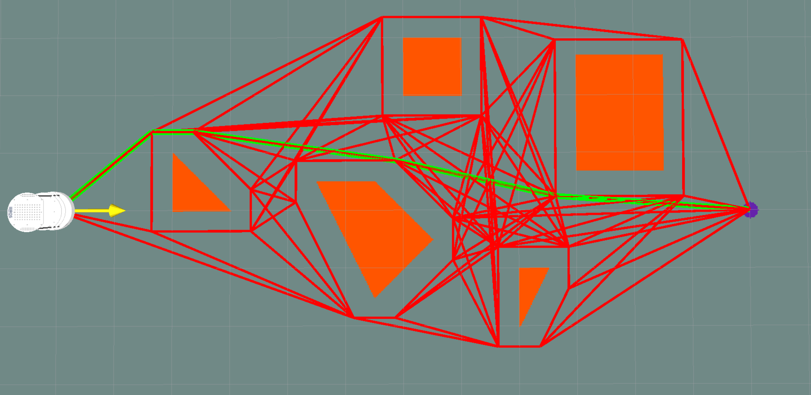

# Lab 3 - Visibility Graph Path Planning
Lab 3 for [COMSW4733 Computational Aspects of Robotics](http://www.cs.columbia.edu/~allen/F18/index.html) at Columbia University (Instructor: [Prof. Peter Allen](http://www.cs.columbia.edu/~allen/)).

## Introduction
In this lab, you are required to implement visibility graph (vgraph) path planning algorithm using the ArbotiX turtlebot simulator and visualize the graph and robot path following in RViz.

## Usage
This repo is a ROS package that you can add to your own catkin workspace to create a map with obstacles (`map.png` + `map.yaml`) and load it in RViz. It allows you to custom your map with any shape of polygon obstacles. All length unit we use is in **cm**.

### Prerequisites
The package is tested on `python 2.7`, `ROS Indigo`, `Ubuntu 14.04` with `OpenCV 3.1.0` and `numpy 1.15.1`. You should also have the [ros-by-example](https://github.com/pirobot/rbx1.git) code already installed.

### Files
- `data/world_obstacles.txt`: Text file indicating obstacle locations (in **cm**).
  - First line is the total number of obstacles in the world.
  - Each obstacle starts with a number specifying total number of vertices, followed by these vertices' location in counter-clockwise order.
- `data/goal.txt`: Location of the goal (in **cm**).
- `src/create_map.py`: Creates or updates the `map.png` under `maps/` folder, using obatacles and goal defined in the above files.
- `launch/launch.launch`: Launch file to start everything you need.
- `maps/map.png`: Image of the map.
- `maps/map.yaml`: Map metadata.
- `package.xml`: Package metadata.
- `world.rviz`: RViz configuration file.

### Map
The map we use in RViz is 1200cm by 600cm, top left and bottom right are (-300, 300) and (900, -300) respectively. Also note that cells in the RViz grid are 50cm by 50cm. The start position of the robot is always at (0, 0), facing x-positive and the goal is defined in `data/goal.txt`. The obstacles are orange polygons and the goal is a purple dot. More about using the `map_server` package [here](http://wiki.ros.org/map_server).

### Run
Clone this repo and compile it in your catkin workspace
```
cd ~/catkin_ws/src
git clone https://github.com/jingxixu/vgraph.git
cd ../
catkin_make
source devel/setup.bash
rospack profile
```

Then, start everything
```
roslaunch vgraph launch.launch
```

Remeber to start a new terminal if you want to run other commands after this.

To custom obstacles and goal position, modify `/data/world_obstacles.txt` and `/data/goal.txt`, then run the following commands. It will update the `map.png` image file loaded by `roslaunch`. You will need to re-launch everything to visualize the modified map in RViz.
```
roscd vgraph/src
python create_map.py
```

## Instructions and Rubric
You should add python files in `/src` to do this lab. The visualization should be done using [visualization_msgs/Marker](http://docs.ros.org/api/visualization_msgs/html/msg/Marker.html) or [visualization_msgs/MarkerArray](http://docs.ros.org/api/visualization_msgs/html/msg/MarkerArray.html) message (more about using RViz markers [here](http://wiki.ros.org/rviz/DisplayTypes/Marker)). We expect to see the following results in your demo video and from running your programs.

1. Bring up ArbotiX turtlebot simulator and RViz with the map of obstacles and goal we give you. (**20 points**)
<p align="center">
  
</p>

2. Grow the obstacles using reflection algorithm (flip the robot around the reference point, place it at each vertex of the obstacle, and create a convex hull). You can assume the robot to be a 36cm-by-36cm square. You can pick the reference point anyware on this square. Given a list of 2d points, you are allowed to use any existing library/package to return a convex hull. My recommendation is [scipy.spatial.ConvexHull](https://docs.scipy.org/doc/scipy/reference/generated/scipy.spatial.ConvexHull.html). The following example picks the center as the reference point. (**20 points**)
<p align="center">
  
</p>

3. Create the vgraph by first fully connecting all obstacle vertices + start + goal and then implement your own collision checker to remove edges that collides with obstacles (except endpoints). You are **NOT** allowed to use any existing libraries/packages for collision checking and the only package we expect to see in your collision checker is `numpy`. (**20 points**)
<p align="center">
  
</p>

4. Implement your own shortest path finding algorithm to find a shortest path from start to goal. Same as collision checker, you are **NOT** allowed to use any existing package/library. (**20 points**)
<p align="center">
  
</p>

5. Modify your robot controller from Lab 1 and 2 to make the robot follow the path. It is allowed to run this part in a separate program by copying/pasting the returned list of waypoints and feed into your follow-path function. (**20 points**)
<p align="center">
  
</p>

## Submission Guidelines
- You should submit a `lab3_UNI1_UNI2.tar.gz` file which contains the modified package `vgraph` that you cloned.
- It should include all files that we need to reproduce your video demo.
- Remeber to **delete** the `imgs/` folder as we do not need it and it is huge.
- You should replace everything in the existing `README.md` with the following content:
	- Usage: how to run your code to reproduce your video demo. Clearly explain the functionalities of all added scripts.
	- Method: a brief description of your methods.
	- Video: a link to the Youtube video of a working demo
	- Others: anything else you would like to include
- **Violation of these submission instructions will result in point deduction.**
